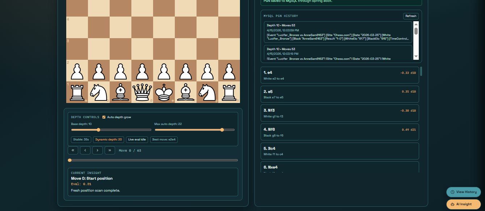
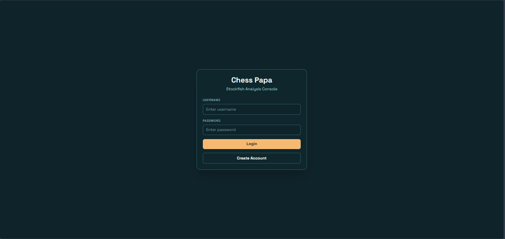
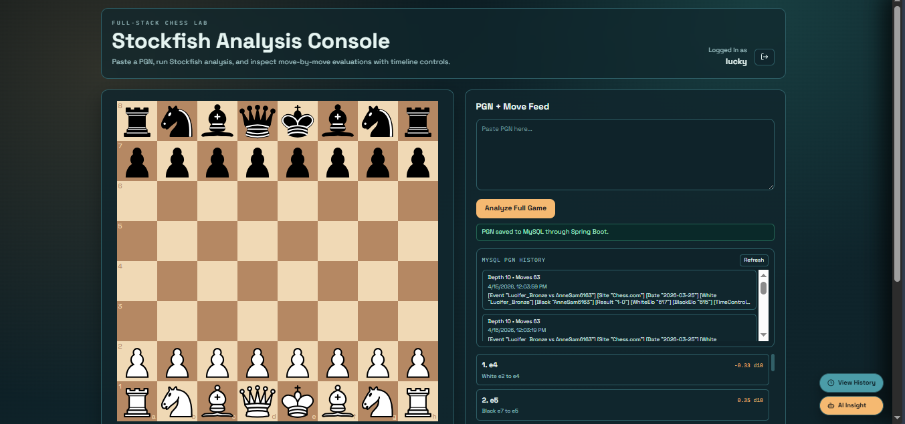

# Chess Papa

Chess Papa is a full-stack chess analysis platform that lets you paste PGNs, run Stockfish evaluation, browse move-by-move insights, save past games to MySQL, and secure the app with JWT authentication.

## Tech Stack

- Frontend: React, Vite, Axios, chess.js, react-chessboard, Tailwind CSS
- Backend: Spring Boot, Spring Security, Spring Data JPA, Validation
- Database: MySQL
- Authentication: JWT with BCrypt password hashing
- Engine: Stockfish UCI binary

## Project Structure

- `frontend/`: React + Vite UI
- `demo/`: Spring Boot backend with authentication, analysis, and PGN history APIs
- `stockfish/`: Stockfish source and Windows binary assets
- `app/`: Legacy Python/FastAPI backend kept in the repository for reference only

## Features

- JWT login and registration
- Protected analysis and history endpoints
- Full PGN analysis with Stockfish evaluations
- Live board inspection and move timeline controls
- MySQL-backed PGN history review panel
- Reload any saved PGN for re-analysis

## Screenshots

### Evaluation Controller



### Login



### View



## Prerequisites

- JDK 25 or a compatible JDK for the Spring Boot demo project
- MySQL 8+
- Node.js 18+
- npm

## Backend Setup: Spring Boot

1. Make sure MySQL is running locally.
2. Open `demo/src/main/resources/application.properties` and update:
   - `spring.datasource.username`
   - `spring.datasource.password`
   - `jwt.secret`
   - `stockfish.path` if your Stockfish binary is elsewhere
3. Ensure the Stockfish executable exists at the configured path.
4. Start the backend:

```powershell
cd demo
.\mvnw.cmd spring-boot:run
```

Backend default URL: `http://127.0.0.1:8080`

## Frontend Setup: React

From `frontend/`:

```powershell
npm install
npm run dev
```

Frontend default URL: `http://localhost:5173`

## Authentication Flow

1. Open the frontend.
2. Register a new user or log in.
3. The JWT token is stored in `localStorage` and sent automatically in the `Authorization` header.
4. Protected endpoints become available after login.

## Environment Variables and Local Config

You can keep local settings in Spring Boot `application.properties` and optionally override the frontend API base URL with:

```env
VITE_SPRING_API_BASE_URL=http://127.0.0.1:8080
```

## Main API Endpoints

Auth:

- `POST /api/auth/register`
- `POST /api/auth/login`

Analysis:

- `POST /api/analyze/full-game`
- `POST /api/analyze/position`

PGN history:

- `GET /api/pgn-history`
- `POST /api/pgn-history`
- `GET /api/pgn-history/{id}`
- `DELETE /api/pgn-history/{id}`

## Example Requests

Login:

```json
{
  "username": "demo",
  "password": "secret123"
}
```

Analyze full game:

```json
{
  "pgn": "1. e4 e5 2. Nf3 Nc6",
  "depth": 10
}
```

Analyze position:

```json
{
  "fen": "startpos FEN here",
  "depth": 10,
  "previousEval": 0.3
}
```

## Notes

- The Spring Boot backend is the current production path.
- The Python/FastAPI backend in `app/` is legacy and is not needed to run the current app.
- Update secrets and credentials before sharing the project.

## Run Order

1. Start MySQL.
2. Start Spring Boot from `demo/`.
3. Start the React frontend from `frontend/`.
4. Register or log in, then analyze a PGN.

## Publish Checklist

- Do not commit real database passwords or JWT secrets.
- Confirm local-only files and binaries are ignored appropriately.
- Verify Stockfish path matches your machine.
